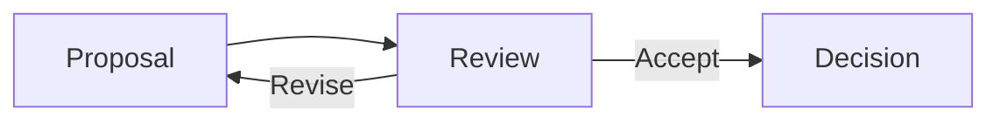

![[assets/project-cover.svg]]

# {{project_name}} - Design Decisions

## Proposed Decisions from Source Session

> [!warning] Proposals, not accepted decisions
> {{decisions}}

Convert accepted items into individual design-decision records after review.

## Review Status

- **Reviewed by user:** No
- **Accepted into project knowledge:** No
