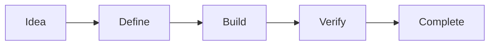

![[assets/project-cover.svg]]

# {{project_name}}

| Stage | Knowledge | Review |
| --- | --- | --- |
| Initial definition | Captured from session | Pending |

> [!summary] Project objective
> The goal, current direction, and immediate work are kept together on this dashboard.

## Objective

{{conclusions}}

## Current Stage

- Initial project creation / definition

## Background

{{discussion}}

## Current Knowledge

> [!info] Known so far
> {{useful_information}}

## Open Questions

> [!question] Needs an answer
> {{open_questions}}

## Next Actions

> [!todo] Working queue
> {{next_actions}}

## Source Session

- `{{source_session}}`

## Review Status

- **Reviewed by user:** No
- **Accepted into project knowledge:** No
