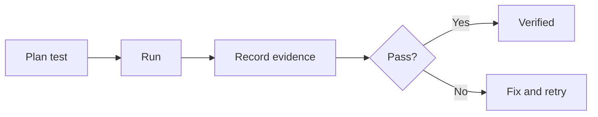

![[assets/project-cover.svg]]

# {{project_name}} - Test Log

## Current Test Status

| Status | Passed | Failed | Blocked |
| --- | ---: | ---: | ---: |
| Not started | 0 | 0 | 0 |

> [!todo] First verification
> Add the first test case, expected result, observed result, and evidence.

## Source Session

- `{{source_session}}`

## Review Status

- **Reviewed by user:** No
